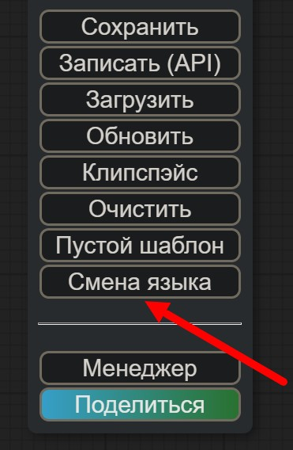

# "ComfyUI RUS" portable
Портабельная версия, не требующая наличия установленных **Python** и **Git**

<a href="https://github.com/ComfyUI-RUS/ComfyUI-RUS-portable/releases/download/ComfyUI-RUS-portable/ComfyUI-RUS-portable.zip">>>> **Скачать ZIP-файл с установщиком по этой ссылке** <<<</a>

---

Распакуйте все содержимое архива в папку, в которую требуется установить портабельную версию **"ComfyUI RUS"**.

В архиве находится портабельные верся Git, кроме нее еще три bat-файла:

- **install.bat** 
- **run.bat**
- **update.bat**

Для автоматической установки системы **ПЕРВЫМ** запустите файл **install.bat**.

>Повторный запуск этого файла начнет установку заново! 

---

Файл **install.bat** сам скачивает и устанавливает портабельную версию **Python** и все необходимые компоненты, пакеты питона и модули. Сам все настраивает и, в конце установки, самостоятеьлно запускает браузер и подключает его к **"ComfyUI RUS"**.

---

Второй файл служит для запуска уже установленной системы, третий - для обновления версий самого **"ComfyUI RUS"**, и устанавливаемых этим инсталлятором расширений.

---

Установденная таким образом система является портабельной, и не привязана к конкретной папке или диску, та как все пути рассчитываются от положения bat-файлов инсталляции и запуска.

---

Во время установки пакетов питона могут вылезать предупреждения (обычно желтым цветом) о том, что питон не может найти определеныые файлв, которые он не может найти в PATH. 

Это не **"Ошибка"**!

Это всего лишь **"Уведомление"** о том, что питон не может найти файлы, которые, на самом деле, для работы этой системы не требуются и убраны для уменьшения размера закачиваемых данных.

Если у вас в системе уже установлены **Python** и **Git**, установите Git-версию **"ComfyUI RUS"**, которая не "тащит" за собой ни **Git**, ни **Питон**. 

Эта версия предназначена для тех, кому *"головные боли с установками и настройками питона и Git не упердись ни в одно место"*.

---

После запуска системы в меню Менеджера (шестеренка) - пункт **"AGLTranslation-langualge"** выбрать язык **"Русский"**.

  
 
  

---

Переключение языка "Русский/Английский" кнопкой менеджера "Switch Locale/Смена языка". 
Время переключения интерфейса "Русский/Английский" - моментальное.
  

  

---

Проект содержит только русский (и английский) языки, все остальные языки отключены, поскольку он рассчитан только на территорию России. Проект локализации **"AIGODLIKE"** "ru-RU" по соглашению с Китаем берется отсюда, т.е., фактически, официальным проектом русской локализации **"ComfyUI"** является этот git-ресурс. Здесь всегда последние обновления русской локализации для "ComfyUI", публикуются онлайн.

---

Обновление ноды в **"ComfyUI"** (пока) вручную. В терминале открыть папку:

- **"custom_nodes\NStor-ComfyUI-Translation\"**

и находясь именно в этой папке выполнить команду:

- **git pull**

В настоящий момент переведены все встроенные меню, панели, диалоги, названия и т.п., до чего смогли технологически добраться не влезая и не изменяя код самого **"ComfyUI"**, т.к. это считаем необходимым условием доверия к подобного рода софту. Мы никогда не изменяем ни одного знака (даже пробела) в исходном коде, который написан не нами. Любые обвинения типа "До установки вашего приложения все работало, а теперь перестало" являются необоснованными. Ни установка, ни удаление пакета локализации, никак не влияет на работоспособность основной системы.

---

В системе не переводились наименования нод, пунктов входов/выходов, заголовки, пункты настроек и т.п., которые являются общепринятыми привычными для пользователей, знакомых с "ComfyUI". Исключением являются лишь некоторые "обще-понятные" названия.  

---

В дальнейшем планируется локализовать основные популярные ноды и модули. Если вас что-то не устраивает в переводе, или вы начинаете путаться в локализованной версии, просто нажмите кнопку **"Смена языка"** *("Switch locale")*, и произойдет автоматическое переключение на встроенный английский язык. 

---

Уже переведенные ноды (файлы локализации) находятся в папке "ru-RU\Nodes" в файлах с именем, одинаковым с названием ноды, и с расширением **JSON**.

---

Перевод встроенных нод в файле - **internal.json**

---

Для изменения перевода откройте нужный файл и измените русское название на свое, если вам так больше нравится.

---

Для выключения перевода конкретных нод(ы), просто переименуйте нужный файл так, чтобы его имя не совпадало с названием ни одной ноды, установленной в системе, или просто удалите этот файл. После чего перезагрузите питон, и выбранная нода больше переводиться не будет. Для восстановления перевода, просто закиньте одноименный с нодой файл перевода с расширением **JSON**, и перезагрузите питона.

---

Все замечания, предложения в [Telegram](https://t.me/comfyui_rus)

---

Далее - немного скриншотов переведенного интерфейса:  
  
 
  
 
  
 
  
 
  
 
  

---

Удачи! )))

P.S.

Претензии типа:

***- "А вот неправильно там вот переведено!!!"***

***- "А у вас так, а надо было так!"***

   не принимаются!)))
   
Файлы у вас есть, зайдите и напишите сами так, как вам надо )))

Если вы сами что-то переведете, то присылайте нам, мы включим ваш перевод в выпуск, не вопрос )))

